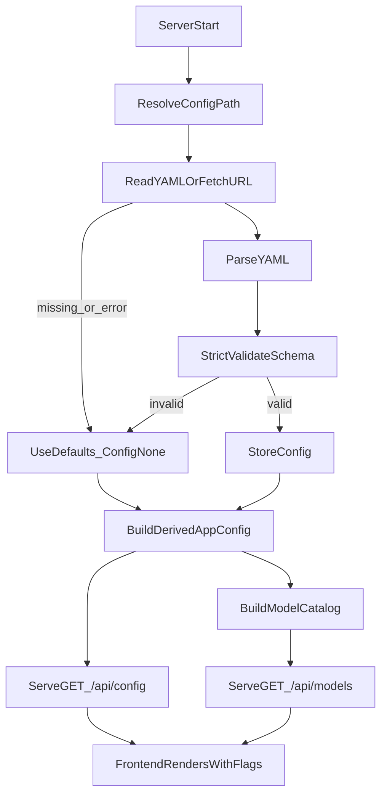

## 03. Plan — Match LibreChat YAML (Schema + Parsing + Usage) in T3Chat

### Goals

-   Adopt **LibreChat’s `librechat.yaml` schema** (key names, nesting, defaults, strictness) as T3Chat’s primary config contract.
-   Match LibreChat’s **behavior**:
    -   **Non-fatal config**: missing/invalid config file should **not** crash startup; fall back to safe defaults and emit **notices**.
    -   **Lazy placeholder resolution**: do **not** hard-require env vars at load time; preserve `${ENV_VAR}` placeholders and resolve them at the point of use (or disable features/providers and warn).
    -   **Strict validation when config file exists**: invalid schema should cause config to be ignored (with clear logs/notices), mirroring LibreChat’s `configSchema.strict().safeParse(...)` behavior.
-   Split work into **Backend** and **Frontend** tracks so two devs can work in parallel.
-   Keep T3Chat-specific functionality (Rust Axum server + Vite React client) but align config semantics with LibreChat’s documented expectations: [LibreChat librechat.yaml docs](https://www.librechat.ai/docs/configuration/librechat_yaml).

---

### A. Key Differences (LibreChat vs Current T3Chat YAML)

#### A1. Root schema + naming

-   **LibreChat (`librechat.example.yaml`)**
    -   Root keys include `version`, `cache`, `interface`, `registration`, `actions`, `endpoints`, etc.
    -   Mostly **camelCase** (e.g. `fileStrategy`, `modelSpecs`, `baseURL`, `apiKey`, `dropParams`).
    -   Uses **schema defaults** heavily (`interface` defaults many booleans to true).
-   **T3Chat (`t3chat.example.yaml`)**
    -   Root keys are `app_title`, `interface`, `providers`, `model_specs`.
    -   Mostly **snake_case**.
    -   Validates “at least one provider must be configured” and **fails** when env vars are missing.

#### A2. Provider config model

-   **LibreChat** organizes AI configuration under `endpoints:`
    -   Built-ins: `openAI`, `google`, `anthropic`, `bedrock`, `azureOpenAI`, `assistants`, `agents`, etc.
    -   Custom endpoints: `endpoints.custom: - name: ... apiKey: ... baseURL: ...`
    -   Many optional controls: `headers`, `addParams`, `dropParams`, title generation fields, etc.
-   **T3Chat** uses `providers:` with fixed keys + `custom:` list and `models: { fetch, default }`.

#### A3. Placeholder semantics

-   **LibreChat behavior** (observed in `packages/api/src/utils/env.ts`):
    -   Resolves `${ENV_VAR}` _when using the values_, not by rewriting the whole YAML at load-time.
    -   Unknown/missing env vars generally don’t crash startup; they remain as placeholders or cause feature/provider-level disablement.
-   **T3Chat behavior** (observed in `server/src/config/mod.rs`):
    -   Performs whole-file `${ENV_VAR}` interpolation early and **errors** if any referenced env var is missing.

---

## Backend (Rust / server) — Implementation Plan

### B0. “Compatibility Contract” decisions

-   **Config file name + path lookup**
    -   Mirror LibreChat:
        -   Support env var `CONFIG_PATH` (can be path or `http(s)://` URL).
        -   Default search order:
            -   `CONFIG_PATH` if set
            -   `T3CHAT_CONFIG` (legacy override) if set
            -   `./librechat.yaml` if present
            -   `./t3chat.yaml` if present (compat bridge; optional)
            -   otherwise: “no config file” → defaults
-   **Schema**
    -   Adopt LibreChat schema names as-is (`version`, `interface`, `endpoints`, `modelSpecs`, …).
    -   Keep a minimal T3Chat-only extension block if needed (e.g. `t3chat: {...}`) but avoid mixing into core LibreChat keys.

### B1. Add a Rust representation of LibreChat config (schema)

**Owner**: Backend dev

-   **Files**
    -   `server/src/config/mod.rs` (loader orchestration; currently exists)
    -   `server/src/config/librechat.rs` (new: structs + validation)
    -   `server/src/config/notices.rs` (new: notice types, aggregation)
-   **Work**
    -   Implement `T3ChatConfig` with `serde`:
        -   `#[serde(rename_all = "camelCase")]` for most nested structures
        -   Use explicit renames where LibreChat uses mixed casing (e.g. `openAI`, `azureOpenAI` keys inside `endpoints`)
    -   Enforce strictness:
        -   `#[serde(deny_unknown_fields)]` on structs where feasible (important for catching typos).
        -   Where LibreChat is intentionally flexible (e.g. `headers: Record<string, any>`), use `serde_json::Value`/`HashMap<String, Value>`.

**Acceptance**

-   A config that matches `librechat.example.yaml` parses into Rust types without custom hacks.

### B2. Implement LibreChat-style loader behavior

**Owner**: Backend dev

-   **Goal**: “Load or ignore, never crash” unless _server cannot run for other reasons_ (DB, etc.)
-   **Match LibreChat semantics**
    -   Missing file:
        -   Log warn, return `LoadedConfig { config: None, metadata: missing_file=true }`
    -   Invalid YAML or schema:
        -   Log error (once per process), return `config: None` (fallback)
    -   Version mismatch:
        -   Do **not** fail; emit notice equivalent to LibreChat’s `checkConfig` warning.
-   **Remote config**
    -   Support `CONFIG_PATH` pointing to an `http(s)://` URL (LibreChat supports this).
    -   Implement small HTTP fetch with timeout; on failure treat as “no config” + notice.

### B3. Replace “fail-fast env interpolation” with “lazy resolution + notices”

**Owner**: Backend dev

-   Remove current “missing env var => error”.
-   Introduce resolution utilities similar to LibreChat’s `processSingleValue` / `resolveNestedObject`:
    -   `${ENV_VAR}` → if set, substitute; else keep original placeholder.
    -   (Optional later) `{{T3CHAT_*}}` runtime placeholders if you want parity with LibreChat’s `{{LIBRECHAT_USER_*}}` and `{{LIBRECHAT_BODY_*}}`. Not required for initial parity unless T3Chat plans to expose per-user template variables.
-   Add provider-level enablement logic:
    -   If a provider requires an API key and the resolved key is still placeholder/empty, mark provider as disabled and emit a warning notice.

### B4. Map LibreChat `endpoints` to T3Chat provider system

**Owner**: Backend dev

-   **Design mapping**
    -   LibreChat built-in endpoints to T3Chat providers:
        -   `endpoints.openAI` → T3Chat OpenAI provider
        -   `endpoints.anthropic` → T3Chat Anthropic provider
        -   `endpoints.google` → T3Chat Google provider
        -   `endpoints.bedrock` → (future or stub; parse now, implement later)
        -   `endpoints.custom[]` → T3Chat “custom OpenAI-compatible endpoint(s)” provider(s)
    -   Preserve LibreChat’s fields that matter for requests:
        -   `baseURL`, `apiKey`, `headers`, `addParams`, `dropParams`, `models.fetch`, `models.default`, `titleConvo`, etc.
-   **Implementation**
    -   Update `server/src/ai/model_catalog.rs` and provider constructors to accept a resolved-per-request config object.

### B5. Update startup + config endpoints to be LibreChat-like

**Owner**: Backend dev

-   Current T3Chat endpoint: `GET /api/config/startup` returns a small object.
-   Add/adjust to mirror LibreChat’s “startup config contract”:
    -   New endpoint recommended: `GET /api/config` (or keep `/startup` but align fields).
    -   Payload should include:
        -   `appTitle` (or your existing `app_title`, but if adopting schema, prefer `appTitle`)
        -   `interface` section from LibreChat
        -   `modelSpecs` (LibreChat style, if provided)
        -   `notices` array (your existing concept is good; keep it)
    -   Keep sensitive values out of responses (no api keys).

### B6. Cache/reload behavior (match LibreChat’s “cached AppConfig”)

**Owner**: Backend dev

-   LibreChat caches AppConfig and derived startup config.
-   T3Chat should:
    -   Keep an `Arc<AppConfig>` (derived) in `AppState`.
    -   Optionally add an admin-only endpoint `POST /api/admin/config/reload` to re-read YAML and rebuild catalogs.
    -   Ensure config reload updates:
        -   model catalog
        -   provider availability
        -   startup notices

### B7. Update T3Chat model catalog build to tolerate “no managed providers”

**Owner**: Backend dev

-   Today: `T3ChatConfig::validate()` requires at least one provider; this conflicts with LibreChat behavior (missing config should still start).
-   Change behavior to:
    -   Empty config → no managed providers, but app still starts.
    -   BYOK / per-user keys can still work if you support it; otherwise show a notice.

### B8. Testing parity (backend)

**Owner**: Backend dev

-   Add unit/integration tests for:
    -   Missing config file → startup ok + notice
    -   Invalid config schema → startup ok + notice
    -   Unset `${ENV_VAR}` placeholders → no crash; provider disabled + notice
    -   Version mismatch → notice only
-   Use LibreChat docs as reference for expected config fields: [LibreChat librechat.yaml docs](https://www.librechat.ai/docs/configuration/librechat_yaml)

---

## Frontend (React / client) — Implementation Plan

### F1. Update config types to LibreChat schema

**Owner**: Frontend dev

-   **Files**
    -   `client/src/types/config.ts` (update types)
    -   Any config consumers: `client/src/App.tsx`, `client/src/components/sidebar.tsx`, `client/src/pages/Models.tsx`, etc.
-   **Work**
    -   Replace `StartupConfigResponse` shape to match new backend payload:
        -   `interface` should carry LibreChat-style flags (e.g. `modelSelect`, `endpointsMenu`, `presets`, …)
        -   `modelSpecs` (LibreChat naming) instead of `model_specs`
    -   Keep `notices` and display them.

### F2. Update API client to fetch the new endpoint/shape

**Owner**: Frontend dev

-   **Files**
    -   `client/src/lib/t3-chat-client.ts`
-   **Work**
    -   Update `getStartupConfig()` to call the chosen endpoint and return the updated type.
    -   Ensure any cached startup config in the UI is refreshed on reload if you add backend reload.

### F3. Align UI behavior with LibreChat interface flags

**Owner**: Frontend dev

-   Enforce gating based on config:
    -   If `interface.modelSelect` is false → hide model selection UI.
    -   If `interface.endpointsMenu` is false → hide provider switching UI.
    -   If `modelSpecs` exists and you want LibreChat-like behavior:
        -   show “spec picker” vs raw provider+model picker
-   Ensure the existing `ConfigWarningBanner` keeps working:
    -   It already consumes `notices`; just ensure messages remain meaningful.

### F4. “Model selection” UX update for LibreChat `modelSpecs` concept

**Owner**: Frontend dev

-   If `modelSpecs` are configured:
    -   Prefer showing model specs as the primary selection list (LibreChat style).
-   If `modelSpecs` absent:
    -   Fall back to provider+model selection (if enabled).

### F5. Frontend acceptance tests / QA checklist

**Owner**: Frontend dev

-   App loads with no YAML file → banner warns but UI still renders.
-   App loads with YAML but missing env vars → banner warns; missing providers are hidden/disabled.
-   Model selection UI matches config toggles.

---

## Shared Integration Notes (Backend ↔ Frontend Contract)

### Contract-first JSON schema (recommended)

Lock a stable JSON contract for the “startup config” response. Suggested minimal shape:

-   `appTitle: string`
-   `interface: { ...LibreChat interface fields... }`
-   `modelSpecs?: { list: ModelSpec[]; ... }`
-   `notices: { kind: "info"|"warning"; message: string }[]`

This allows both devs to work in parallel.

---

## Implementation Sequence (Parallel)

### Backend developer

-   Implement B1–B3 first (schema + loader + lazy resolution)
-   Then B4–B5 (map endpoints → providers; startup endpoint)
-   Then B6–B8 (cache/reload + tests)

### Frontend developer

-   Implement F1–F2 immediately once the contract is drafted
-   Then F3–F5 once the backend endpoint is available

---

## Mermaid: Config Load + Use Flow

---

## Open Questions (already decided)

-   Adopt LibreChat schema: **Yes**
-   Lazy placeholder resolution (no fail-fast env): **Yes**

---

## Done Criteria

-   T3Chat starts even with no `librechat.yaml` or with missing env vars.
-   When config exists and is invalid, it is ignored with clear warnings/notices.
-   When config is valid, UI behavior and provider/model availability reflects it predictably.
-   The YAML parsing + usage semantics mirror LibreChat expectations per docs: [LibreChat librechat.yaml docs](https://www.librechat.ai/docs/configuration/librechat_yaml).
